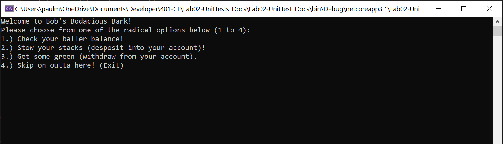
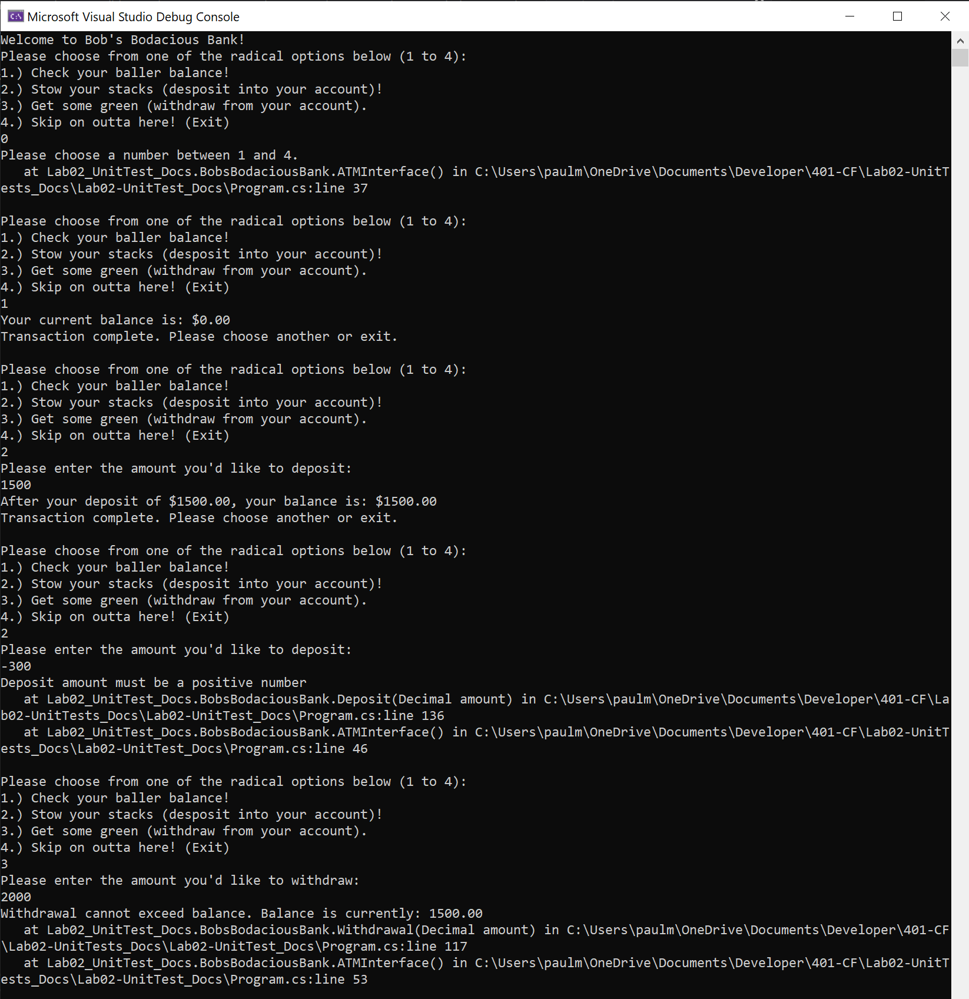
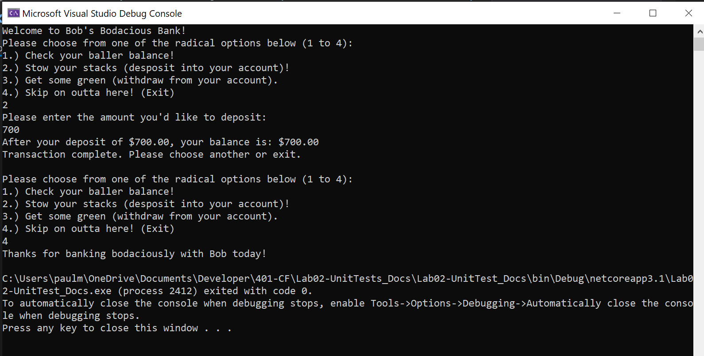

# CF - 401 - Lab 02 - Unit Tests & Documentation

## ATM App (Bob's Bodacious Bank)

*Author: Paul M Rest*

----

## Description
C#/.NET Core console application that recreates the core functionality of an ATM. Starts
off with a balance of $0.00, and allows the user to deposit and withdraw money from
that account. Prevents the balance from dropping below $0.00. Prevents the user
from depositing or withdrawing a negative amount.

Continues to ask for the user's next transaction until they choose to exit.

---

### Getting Started
Clone this repository to your local machine.

In a command line environment with Git installed:

```
git clone <<GIT REPO URL HERE>>
```

### To Run the Program from Visual Studio (2019):
Select ```File``` -> ```Open``` -> ```Project/Solution```

Next navigate to the directory you cloned the repository to.

Double click on the ```Lab02-UnitTest_Docs``` directory.

Then select and open ```Lab02-UnitTest_Docs.sln```

Select ```Debug``` -> ```Start Debugging``` to the run the app with the debugger

OR

Select ```Debug``` -> ```Start Without Debugging```

---

### Visuals

#### ATM App Start

#### Using the ATM

#### Exiting the ATM


---

### Current Version

v0.8

### Change Log

#### 2020-07-07

- v0.1: interface skeleton set up.
- v0.2: testing framework in place.
- v0.4: core logic completed - passes all tests.
- v0.5: interface core functionality in place.
- v0.6: bug fixing and tweaks to interface.
- v0.7: README completed.
- v0.8: tweaks to interface. 

------------------------------
For more information on Markdown: https://www.markdownguide.org/cheat-sheet